# PogodyCast - Weather Forecast App

<div align="center">

[](https://flutter.dev/)
[](https://dart.dev/)
[](LICENSE)

[🇺🇸 English](#-english) | [🇻🇳 Tiếng Việt](#-tiếng-việt)

</div>

---

## 🇺🇸 English

### 📱 About PogodyCast

PogodyCast is a modern, feature-rich weather forecast application built with Flutter. It provides real-time weather information, hourly forecasts, and beautiful visualizations with a focus on user experience and design.

### ✨ Features

- **🌤️ Real-time Weather Data**: Get current weather conditions with detailed information
- **📊 Hourly Forecast**: View 24-hour weather predictions with temperature charts
- **📍 Location Services**: GPS-based location detection with manual city search
- **🌍 Multi-language Support**: English and Vietnamese localization
- **🌙 Dark/Light Theme**: Beautiful themes with smooth transitions
- **🎨 Modern UI/UX**: Clean, intuitive interface with smooth animations
- **📱 Responsive Design**: Optimized for various screen sizes
- **⚡ Fast Performance**: Efficient data loading and caching

### 🛠️ Technical Stack

- **Framework**: Flutter 3.16.0
- **Language**: Dart 3.2.0
- **Weather API**: OpenWeatherMap
- **State Management**: Provider pattern
- **Localization**: Flutter Intl
- **Storage**: SharedPreferences
- **Remote Config**: Firebase Remote Config

### 📦 Installation

1. **Clone the repository**
   ```bash
   git clone https://github.com/dackhang/PogodyCast.git
   cd pogodycast
   ```

2. **Install dependencies**
   ```bash
   flutter pub get
   ```

3. **Configure API Keys**
   - Get your OpenWeatherMap API key from [OpenWeatherMap](https://openweathermap.org/api)
   - Configure Firebase Remote Config with your API key
   ```bash
   flutterfire configure
   ```
   
4. **Run the app**
   ```bash
   flutter run
   ```

### 🏗️ Project Structure

```
lib/
├── home/                 # Main weather screen
├── settings/            # App settings and configuration
├── splash/              # Splash screen with animations
├── services/            # API services and data handling
├── localization/        # Multi-language support
└── main.dart           # App entry point
```

### 🎯 Key Features Implementation

#### Weather Data Integration
- Real-time weather fetching from OpenWeatherMap API
- Automatic location detection using GPS
- Manual city search with popular cities list
- Hourly forecast with temperature visualization

#### Localization System
- Complete English and Vietnamese translations
- Dynamic language switching without app restart
- Weather descriptions in selected language
- Localized city names and UI elements

#### Theme Management
- Dark and light theme support
- Smooth theme transitions
- Persistent theme preferences
- Consistent design across all screens

#### Animation & UX
- Beautiful splash screen with floating weather icons
- Smooth page transitions
- Loading animations and progress indicators
- Interactive temperature charts

### 📱 Screenshots

<div align="center">
  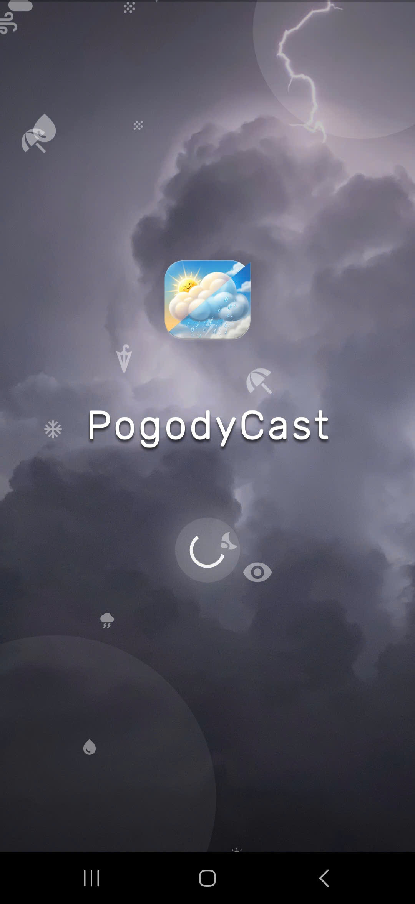
  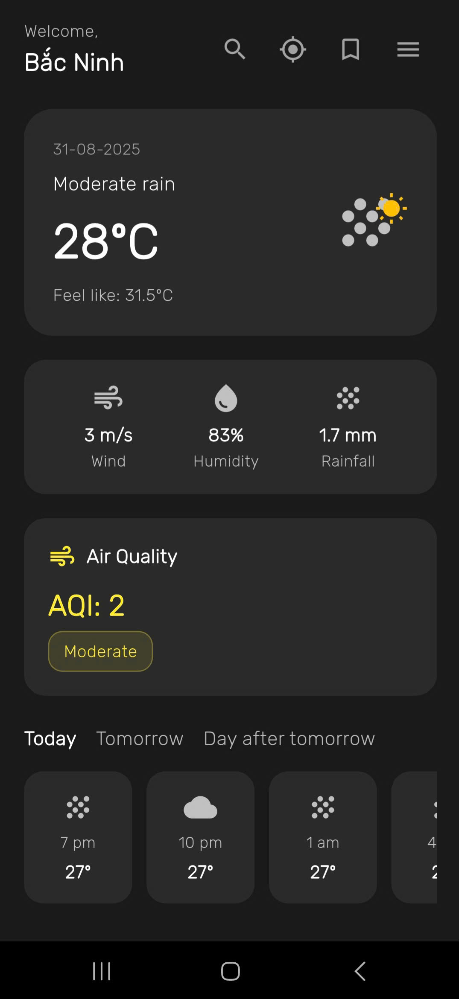
  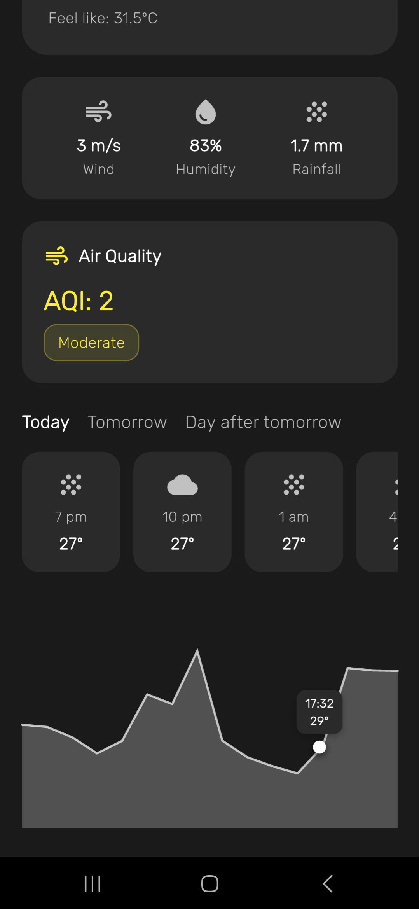
  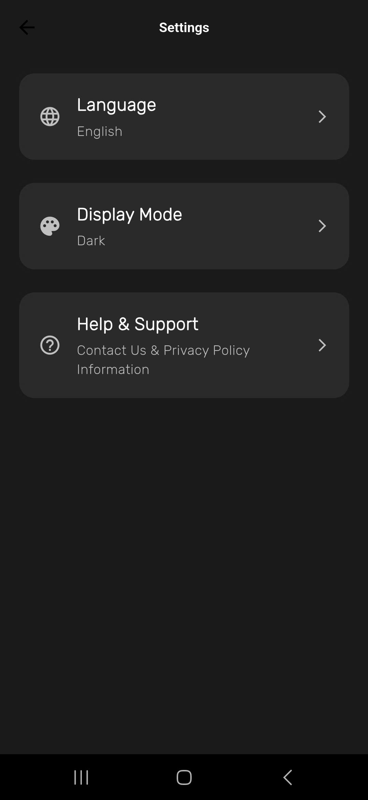
  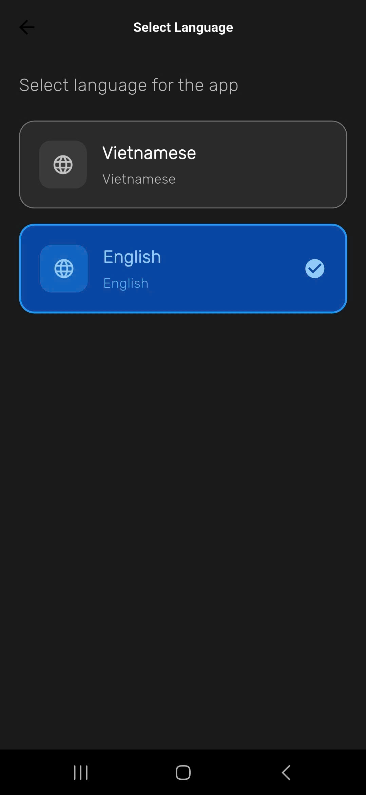
  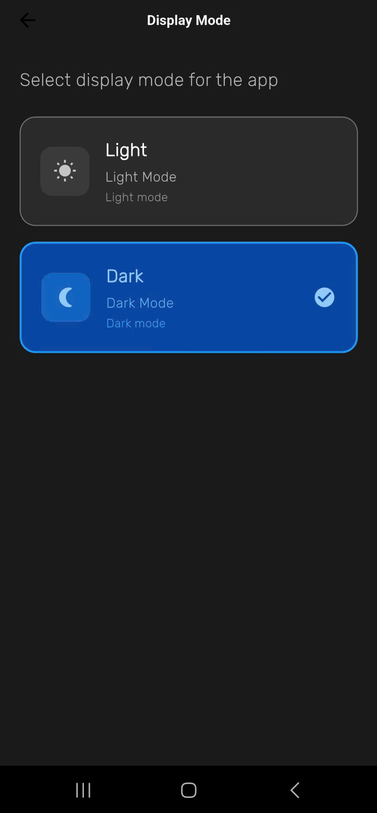
  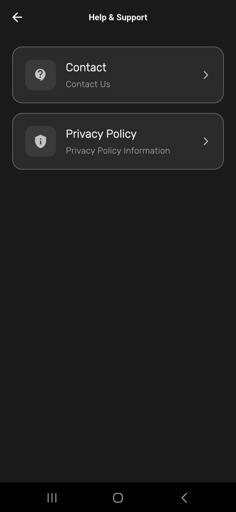
  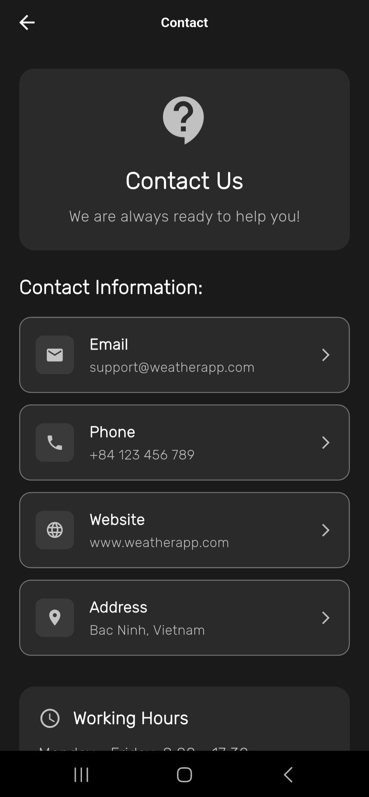
  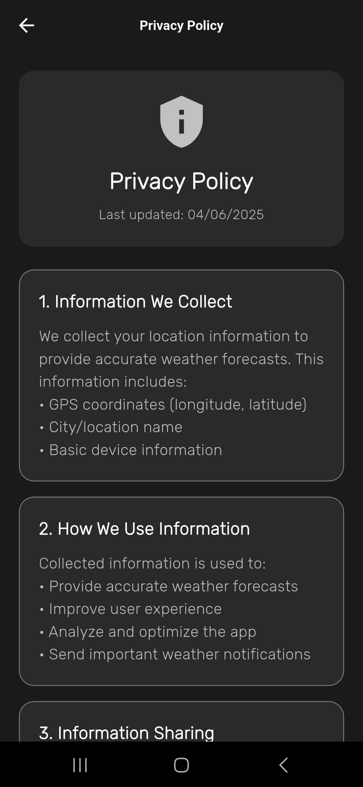
  
</div>

### 🤝 Contributing

We welcome contributions! Please feel free to submit !
[Privacy policy & Contact](https://dackhang.github.io/privacypolicy_pogodycast_app/)

### 📄 License

This project is licensed under the MIT License - see the [LICENSE](LICENSE) file for details.

---

## 🇻🇳 Tiếng Việt

### 📱 Về PogodyCast

PogodyCast là một ứng dụng dự báo thời tiết hiện đại, đầy đủ tính năng được xây dựng bằng Flutter. Ứng dụng cung cấp thông tin thời tiết thời gian thực, dự báo theo giờ và các biểu đồ trực quan đẹp mắt với trọng tâm là trải nghiệm người dùng và thiết kế.

### ✨ Tính năng

- **🌤️ Dữ liệu thời tiết thời gian thực**: Nhận thông tin thời tiết hiện tại với chi tiết đầy đủ
- **📊 Dự báo theo giờ**: Xem dự báo thời tiết 24 giờ với biểu đồ nhiệt độ
- **📍 Dịch vụ định vị**: Phát hiện vị trí dựa trên GPS với tìm kiếm thành phố thủ công
- **🌍 Hỗ trợ đa ngôn ngữ**: Localization tiếng Anh và tiếng Việt
- **🌙 Giao diện tối/sáng**: Giao diện đẹp với chuyển đổi mượt mà
- **🎨 UI/UX hiện đại**: Giao diện sạch sẽ, trực quan với animation mượt mà
- **📱 Thiết kế responsive**: Tối ưu cho nhiều kích thước màn hình
- **⚡ Hiệu suất cao**: Tải dữ liệu và cache hiệu quả

### 🛠️ Công nghệ sử dụng

- **Framework**: Flutter 3.16.0
- **Ngôn ngữ**: Dart 3.2.0
- **Weather API**: OpenWeatherMap
- **Quản lý state**: Provider pattern
- **Localization**: Flutter Intl
- **Lưu trữ**: SharedPreferences
- **Remote Config**: Firebase Remote Config

### 📦 Cài đặt

1. **Clone repository**
   ```bash
   git clone https://github.com/dackhang/PogodyCast.git
   cd pogodycast
   ```

2. **Cài đặt dependencies**
   ```bash
   flutter pub get
   ```

3. **Cấu hình API Keys**
   - Lấy API key OpenWeatherMap từ [OpenWeatherMap](https://openweathermap.org/api)
   - Cấu hình Firebase Remote Config với API key của bạn
   ```bash
   flutterfire configure
   ```
   
4. **Chạy ứng dụng**
   ```bash
   flutter run
   ```

### 🏗️ Cấu trúc dự án

```
lib/
├── home/                 # Màn hình thời tiết chính
├── settings/            # Cài đặt và cấu hình ứng dụng
├── splash/              # Màn hình splash với animation
├── services/            # API services và xử lý dữ liệu
├── localization/        # Hỗ trợ đa ngôn ngữ
└── main.dart           # Điểm khởi đầu ứng dụng
```

### 🎯 Tính năng chính

#### Tích hợp dữ liệu thời tiết
- Lấy dữ liệu thời tiết thời gian thực từ OpenWeatherMap API
- Tự động phát hiện vị trí sử dụng GPS
- Tìm kiếm thành phố thủ công với danh sách thành phố phổ biến
- Dự báo theo giờ với biểu đồ nhiệt độ trực quan

#### Hệ thống đa ngôn ngữ
- Dịch thuật hoàn chỉnh tiếng Anh và tiếng Việt
- Chuyển đổi ngôn ngữ động không cần restart app
- Mô tả thời tiết theo ngôn ngữ được chọn
- Tên thành phố và UI elements được localize

#### Quản lý giao diện
- Hỗ trợ giao diện tối và sáng
- Chuyển đổi giao diện mượt mà
- Lưu trữ tùy chọn giao diện
- Thiết kế nhất quán trên tất cả màn hình

#### Animation & UX
- Màn hình splash đẹp với các icon thời tiết bay lơ lửng
- Chuyển trang mượt mà
- Animation loading và progress indicators
- Biểu đồ nhiệt độ tương tác

### 📱 Hình ảnh

<div align="center">
  
  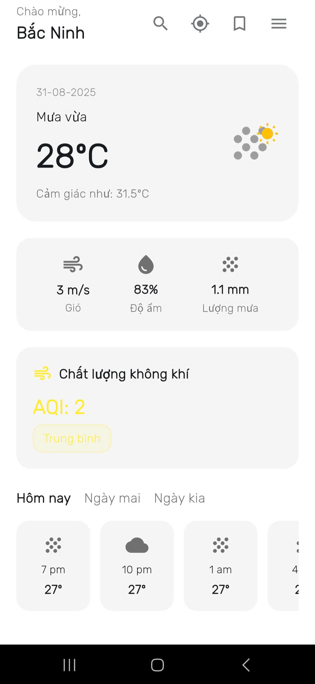
  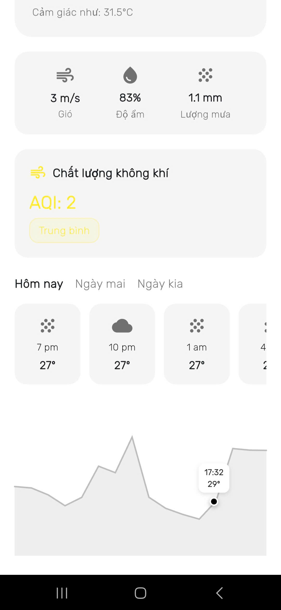
  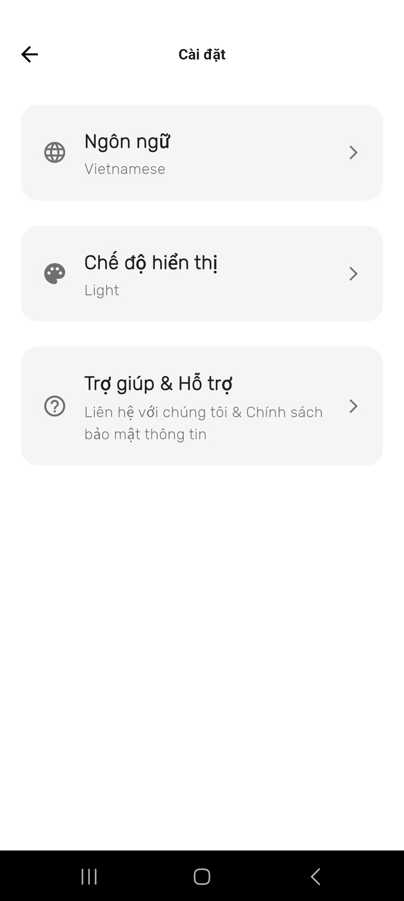
  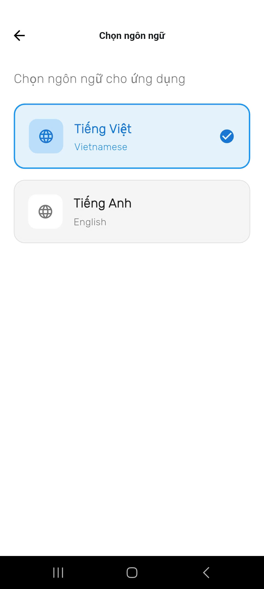
  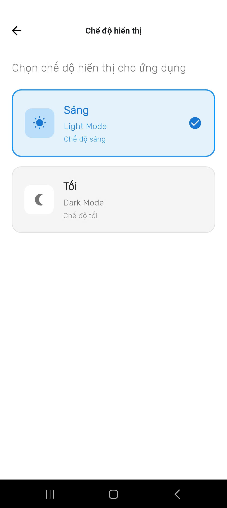
  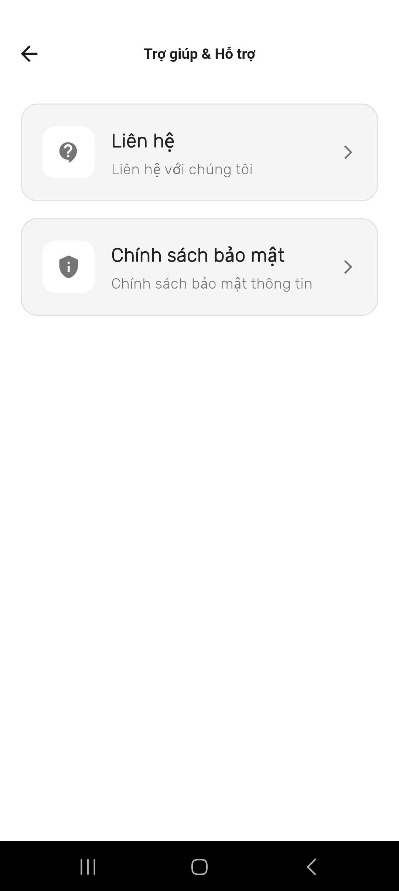
  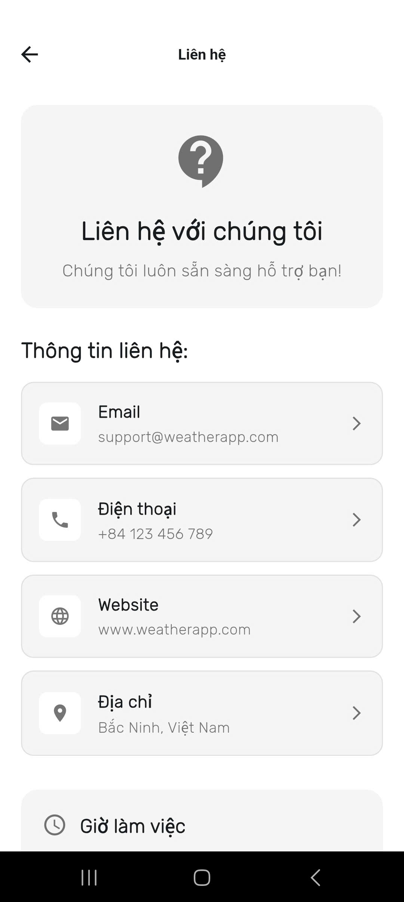
  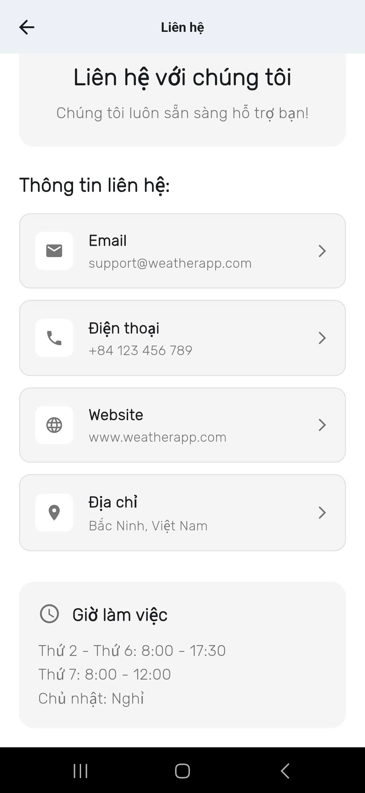
  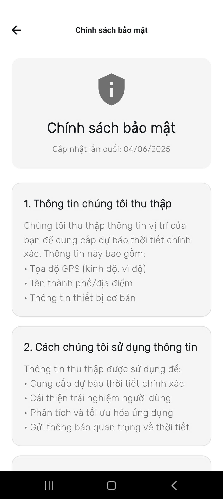
  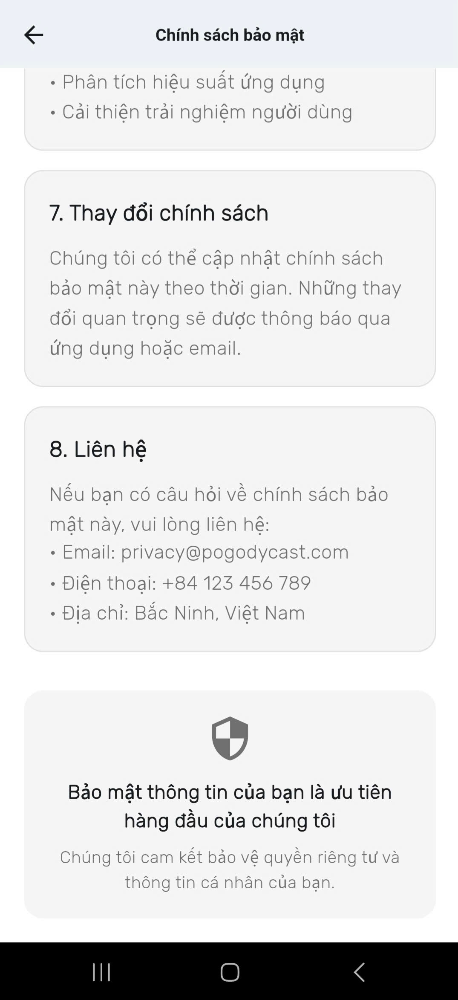
</div>

### 🤝 Đóng góp

Chúng tôi hoan nghênh mọi đóng góp! Hãy tự nhiên submit !
[Privacy policy & Contact](https://dackhang.github.io/privacypolicy_pogodycast_app/)

### 📄 Giấy phép

Dự án này được cấp phép theo MIT License - xem file [LICENSE](LICENSE) để biết chi tiết.

---

<div align="center">

**Made with ❤️ by Ness**

[⬆️ Back to top](#pogodycast---weather-forecast-app)

</div>
